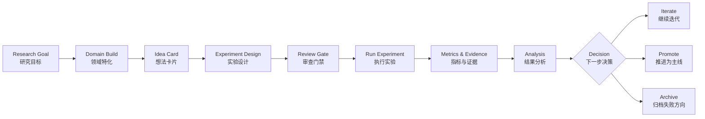

# Any Science Framework

<p align="center">
  <a href="./README.md">简体中文</a> |
  <a href="./README.zh-TW.md">繁體中文</a> |
  <a href="./README.en.md">English</a>
</p>

<p align="center">
  <strong>Turn AI-assisted research into a structured, reviewable, reproducible workflow.</strong>
</p>

<p align="center">
  一个面向科研人员的 AI Research Workspace Generator。<br/>
  让你的科研想法、实验、结果、审查和迭代，不再散落在聊天记录里。
</p>

---

## AnyVoice Companion（Windows 原生桌面伴侣）

仓库现在包含一个与科研工作区解耦的 Windows 桌面语音伴侣基础工程。它使用 .NET 8 WPF 和当前用户专属 Named Pipe，不需要 WSL，也不占用本地 HTTP 端口。

第二、三阶段现已包含：

- 透明、置顶、可拖动的最小桌面角色与字幕；
- `idle`、`listening`、`thinking`、`speaking`、`success`、`needsInput`、`error` 状态；
- 带长度上限的 JSON 事件协议；
- 密钥、Authorization、完整 Windows 路径和代码块播报过滤；
- 当前 Windows 用户隔离的 Named Pipe 服务端和客户端；
- 单实例、系统托盘、设置持久化、窗口位置与字幕显示控制；
- 默认使用简体中文的桌面界面；
- 可在设置中启用、默认关闭的当前用户 Windows 开机自启动；
- 通过 Windows `System.Speech` 提供的可选 TTS 播报；
- 复用本机 FFmpeg、Whisper CLI 和已有 `.pt` 模型的离线听写；
- 默认关闭的 `Ctrl+Alt+V` 全局听写热键；
- 听写结果仅复制到剪贴板，不自动执行，也不自动朗读原始转写；
- 不依赖 NuGet 测试框架的离线测试套件。

在 PowerShell 中运行：

```powershell
# 只检查 .NET 8 SDK；缺少时不会自动安装
powershell -NoProfile -ExecutionPolicy Bypass -File .\scripts\bootstrap_companion.ps1

# 测试并构建
powershell -NoProfile -ExecutionPolicy Bypass -File .\scripts\test_companion.ps1

# 启动桌面伴侣；可从角色右键菜单或系统托盘退出
powershell -NoProfile -ExecutionPolicy Bypass -File .\scripts\run_companion.ps1
```

请使用 `run_companion.ps1` 启动。当前构建依赖用户级 .NET 8，直接双击 Release 目录中的框架依赖型 EXE 可能会误用系统级旧版 .NET。

首次使用听写前，可在 `设置 > 语音 > 检测本地工具` 自动检测本机组件，也可以显式配置：

```powershell
powershell -NoProfile -ExecutionPolicy Bypass -File .\scripts\configure_companion.ps1 `
  -FfmpegPath 'D:\tools\ffmpeg\bin\ffmpeg.exe' `
  -WhisperPath 'D:\python\Scripts\whisper.exe' `
  -ModelPath "$HOME\.cache\whisper\tiny.pt" `
  -AudioDevice '麦克风 (USB Audio)'
```

启动后，从托盘选择“开始听写”，再选择“停止并转写”；转写成功后文字会进入剪贴板。启用全局热键后，连续两次按 `Ctrl+Alt+V` 可完成同一流程。所有 Whisper 调用都设置为离线模式，缺少模型时会报错，不会自动下载。

“随 Windows 启动”位于“设置 > 常规”，默认关闭。启用后只会写入当前用户的 `HKCU\Software\Microsoft\Windows\CurrentVersion\Run`，不需要管理员权限；再次关闭会删除 AnyVoice 自己的启动项，不影响其他程序。

AnyVoice Companion 独立保存配置到 `%LOCALAPPDATA%\AnyVoiceCompanion\config.json`，不会覆盖原有 Any Science Voice 脚本，也不要求 WSL。角色包导入、Codex 适配器和 Claude Code 适配器仍属于后续阶段。

完整设计见 [`docs/superpowers/specs/2026-07-10-anyvoice-companion-design.md`](docs/superpowers/specs/2026-07-10-anyvoice-companion-design.md)。

---

## Any Science Framework 是什么？

**Any Science Framework** 是一个面向 AI 辅助科研的本地科研工作区生成器。

它可以帮你生成一个带有 **科研总管、领域专家、实验设计者、执行者、分析者和审查者** 的本地工作区，让 AI 不再只是“聊天给建议”，而是按照固定科研流程帮你推进：

```text
想法 → 实验设计 → 审查 → 执行 → 结果分析 → 迭代 / 推进 / 归档
```

你可以把它理解成一个轻量版的 **AI Research Operating System**：

- 它不是普通 prompt 集。
- 它不是单个 Agent。
- 它不是论文写作模板。
- 它是一个可以把科研过程沉淀到文件、协议、状态和审查记录中的工作区框架。

---

## 它适合谁？

Any Science Framework 适合这些场景：

| 你是谁 | 它能帮你什么 |
|---|---|
| 博士生 / 科研人员 | 管理长期 idea、实验、失败记录和论文主线 |
| AI / ML 研究者 | 把模型实验变成可追踪、可复盘的闭环 |
| 独立研究者 | 用 AI 搭建一个结构化科研助理系统 |
| 使用 Claude Code / Codex 的开发者 | 给 AI Agent 一个更稳定的科研工作区协议 |
| 多项目并行的人 | 防止思路、实验状态和结果结论在多轮对话中丢失 |

如果你经常遇到下面这些问题，它会特别有用：

- “这个 idea 上次讨论到哪里了？”
- “这个实验为什么失败？”
- “这个指标是从哪个结果文件来的？”
- “这个结论有没有经过审查？”
- “我是不是又在重复一个之前被证明不行的方向？”
- “AI 给了很多建议，但没有形成稳定项目资产。”

---

## 使用前 vs 使用后

| 使用普通 AI 对话 | 使用 Any Science Framework |
|---|---|
| 想法散落在聊天记录里 | 每个 idea 都有独立卡片和状态 |
| 实验设计容易临时变化 | 实验前明确目标、指标、对照和成功判据 |
| 结果分析依赖口头总结 | 指标、日志、结论写入结构化文件 |
| AI 容易直接给结论 | reviewer 先审查，总管再推进状态 |
| 失败方向容易遗忘 | 失败 idea 进入 graveyard，保留死因和复活条件 |
| 跨会话难恢复上下文 | 项目状态沉淀在本地工作区中 |

核心变化是：

> 把 AI 科研助手从“会聊天的顾问”，变成“按科研流程工作的本地协作系统”。

---

## 你会得到什么？

运行安装脚本后，你会得到一个新的科研工作区：

```text
my-research-workspace/
├── CLAUDE.md              # 科研总管：负责调度和状态推进
├── PROTOCOL.md            # 科研协议：定义状态、审查、指标和文件规则
├── .claude/               # Agent、commands、skills、hooks
├── domain/                # 你的研究领域档案与领域规则
├── workspace/
│   ├── ideas/             # 想法卡片
│   ├── experiments/       # 实验设计、配置、日志和结果
│   └── knowledge/         # 研究记忆、失败归档、阶段报告
└── scripts/               # 校验与工作流脚本
```

这个工作区会引导你先完成领域特化，然后再进入具体科研任务。

---

## 核心体验

### 1. 先建立你的研究领域

进入工作区后运行：

```text
/build
```

AI 会先问你：

- 你研究什么领域？
- 你的实验资源是什么？
- 你的论文目标是什么？
- 你有哪些不可违反的审查红线？
- 什么样的结果才算有意义？

然后生成领域档案、领域 skill 和 reviewer checklist。

### 2. 把模糊 idea 变成可执行实验

你可以提出一个研究想法，框架会把它推进成：

- idea card
- experiment card
- baseline / ablation / metric plan
- expected outcome
- risk and fallback
- reviewer comments

### 3. 让实验结果进入可复盘闭环

实验完成后，结果不会只停留在一句“效果不错”。

框架会要求你沉淀：

- 指标文件
- 日志与配置
- 结果分析
- 是否达到事前成功判据
- 下一步是迭代、推进，还是归档

---

## 产品工作流



---

## 3 分钟开始使用

### 1. 克隆仓库

```bash
git clone https://github.com/feedy-hub/any-science-framework.git
cd any-science-framework
```

### 2. 生成科研工作区

```bash
bash dist/setup.sh /tmp/my-any-science
cd /tmp/my-any-science
```

建议生成到一个新的空目录，避免和已有项目混在一起。

### 3. 启动 Claude Code 并领域特化

```bash
claude
```

进入会话后运行：

```text
/build
```

完成 `/build` 后，你就拥有了一个按你的研究方向定制的 AI 科研工作区。

---

## 典型使用场景

### 场景一：管理博士课题中的多个 idea

你可以把每个想法写成 idea card，让 scholar 做新颖性检查，让 methodologist 设计最小验证实验，再让 reviewer 判断是否值得投入更多资源。

### 场景二：管理机器学习实验闭环

你可以把一次实验拆成目标、数据、baseline、指标、成功判据和失败预案。实验完成后，analyst 会根据事前标准判断是否推进，而不是临时改变结论口径。

### 场景三：构建自己的领域科研 Agent

你可以通过 `/build` 把框架特化到不同领域，例如 AI/ML、语音、多模态、生物医学、材料科学、社会科学或理论研究。

### 场景四：把失败经验变成资产

失败的 idea 不会被简单删除，而会被记录到 graveyard 中，包括失败原因、证据和未来可能复活的条件。

---

## 内置角色

Any Science Framework 默认不是一个“万能助手”，而是一组分工明确的科研角色：

| 角色 | 产品化理解 | 主要职责 |
|---|---|---|
| PI / 总管 | 科研项目经理 | 维护主线、调度角色、推进状态 |
| Builder | 领域初始化向导 | 通过 `/build` 建立领域档案和规则 |
| Scholar | 文献与 idea 助手 | 做调研、新颖性检查、idea 发掘 |
| Methodologist | 实验设计师 | 把 idea 变成可验证实验 |
| Executor | 实验执行者 | 写代码、跑实验、整理结果 |
| Analyst | 结果分析师 | 分析指标、诊断失败、提出下一步 |
| Reviewer | 审查者 | 检查证据、逻辑、指标和结论边界 |

这套角色分工的目的不是制造复杂性，而是避免一个 AI 同时负责“提出想法、设计实验、执行实验、审查自己、宣布成功”。

---

## 为什么不是普通 prompt？

普通 prompt 通常解决的是“这一次怎么回答”。

Any Science Framework 解决的是“一个科研项目如何长期推进”。

它把关键科研资产保存到本地文件中：

- idea 保存在 `workspace/ideas/`
- 实验保存在 `workspace/experiments/`
- 结果和指标保存在实验目录下
- 失败方向保存在 `workspace/knowledge/`
- 状态规则写在 `PROTOCOL.md`
- 总管行为写在 `CLAUDE.md`

所以，即使对话中断，你仍然可以从工作区文件恢复项目状态。

---

## 与 Claude Code / Claude Science 的关系

Any Science Framework 不是 Anthropic 官方产品。

它是一个第三方开源框架，用来生成适合 Claude Code 风格的本地科研工作区。

可以这样理解：

```text
Claude Code：提供 AI 编程与本地项目操作环境
Claude Science：官方科学工作台产品
Any Science Framework：开源科研工作区生成器，强调流程、协议和审查闭环
```

如果说 Claude Science 更像一个产品级科学工作台，那么 Any Science Framework 更像一个可改造的科研工作区模板：轻量、开放、文件化，适合按自己的研究习惯定制。

---

## 设计原则

### Files over chat history

重要科研状态应该沉淀到文件，而不是只留在聊天记录里。

### Workflow over one-shot answer

科研不是一次性回答，而是多轮 idea、实验、分析和修正。

### Review before conclusion

结论必须经过审查，不能因为一次结果看起来不错就直接推进。

### Failed ideas are assets

失败方向也是科研资产。记录失败原因可以减少重复踩坑。

### Human remains the PI

AI 可以协助研究，但最终科学判断仍然属于研究者。

---

## 技术组成

这一部分适合开发者阅读。普通用户只需要看上面的产品介绍和快速开始即可。

```text
any-science-framework/
├── src/
│   ├── setup.sh          # 源码版工作区生成脚本
│   └── setup_test.sh     # 源码版验收测试包生成脚本
├── dist/
│   ├── setup.sh          # 可直接使用的发布版脚本
│   └── setup_test.sh     # 可直接使用的测试包生成脚本
├── scripts/
│   └── build.sh          # 从 src 构建 dist
├── tests/
│   └── smoke.sh          # 端到端回归测试
├── docs/
│   ├── design.md
│   └── plan.md
└── README.md
```

## 可选扩展：UI 和 Voice

仓库提供两个可选扩展安装器，位于 `dist/extensions/`。Windows 可以全程使用 PowerShell，不需要启动 WSL；Linux、macOS 和 WSL 继续使用 Bash 版本。

### 安装本地 UI

Windows PowerShell（使用本机实际路径）：

```powershell
powershell -NoProfile -ExecutionPolicy Bypass -File `
  'D:\fu_files\工作\其他\any-science-framework-dev\dist\extensions\setup_ui.ps1' `
  -WorkspacePath 'D:\fu_files\工作\其他\any-science-workspace'

powershell -NoProfile -ExecutionPolicy Bypass -File `
  'D:\fu_files\工作\其他\any-science-workspace\scripts\ui_start.ps1'
```

安装器会使用当前 Conda 环境或 `PATH` 中可用的 `python.exe`，启动后自动打开浏览器。它支持中文路径和包含空格的路径。

Linux、macOS 或 WSL：

```bash
cd /path/to/my-any-science
bash /path/to/any-science-framework/dist/extensions/setup_ui.sh
bash scripts/ui_start.sh
```

然后打开：

```text
http://127.0.0.1:8321
```

UI 扩展的设计边界：

- UI 只读展示 `workspace/` 中的卡片、结果、知识和 hook 日志。
- 唯一写入口是 `/api/inbox`，只会写入 `workspace/inbox/`。
- UI 输入被视为半信任内容，仍需总管按正常流程处理。
- server 只绑定 `127.0.0.1`，并保留 Host / Origin 校验。
- 安装时如果目标文件已存在，会先创建 `.bak.<timestamp>` 备份。

停止 UI：

```powershell
powershell -NoProfile -ExecutionPolicy Bypass -File `
  'D:\fu_files\工作\其他\any-science-workspace\scripts\ui_stop.ps1'
```

```bash
bash scripts/ui_stop.sh
```

### 安装语音扩展

Windows PowerShell：

```powershell
powershell -NoProfile -ExecutionPolicy Bypass -File `
  'D:\fu_files\工作\其他\any-science-framework-dev\dist\extensions\setup_voice.ps1' `
  -WorkspacePath 'D:\fu_files\工作\其他\any-science-workspace'

powershell -NoProfile -ExecutionPolicy Bypass -File `
  'D:\fu_files\工作\其他\any-science-workspace\scripts\voice\voice_status.ps1'
```

在当前测试机器上，状态检测可以复用 Windows `ffmpeg.exe`、Conda `whisper.exe` 和 `~/.cache/whisper/tiny.pt`。录音使用 DirectShow，不经过 WSL 的 ALSA。

开始一次 8 秒语音输入：

```powershell
$env:ANY_SCIENCE_AUDIO_DEVICE = '麦克风 (AB13X USB Audio)'
$env:ANY_SCIENCE_WHISPER_MODEL = 'tiny'
powershell -NoProfile -ExecutionPolicy Bypass -File `
  'D:\fu_files\工作\其他\any-science-workspace\scripts\voice\dictate.ps1' `
  -Seconds 8
```

PowerShell Voice 强制离线模式。指定模型不存在时会直接报错，不会自动获取；环境变量只接受可执行文件、模型、缓存和设备的路径或名称，不接受拼接命令。

Linux、macOS 或 WSL：

```bash
cd /path/to/my-any-science
bash /path/to/any-science-framework/dist/extensions/setup_voice.sh
bash scripts/voice/voice_status.sh
```

语音扩展不会下载模型，也不会安装依赖。它只检测并复用本地已有工具：

- 录音：`rec`、`arecord` 或 `ffmpeg`
- STT：本地可执行适配器，或带有完整本地模型的 `whisper-cli`、`whisper`、`faster-whisper`
- TTS：`say`、`espeak-ng`、`espeak` 或 WSL 的 `powershell.exe` SAPI

语音输入示例：

```bash
bash scripts/voice/dictate.sh 8
```

如果你已经有本地 STT 适配器，可以显式指定其可执行文件路径：

```bash
export ANY_SCIENCE_STT_ADAPTER=/absolute/path/to/local-stt-adapter
bash scripts/voice/dictate.sh 8
```

转写结果会先让你确认，确认后只写入 `workspace/inbox/`，不会直接修改任何 idea、实验或结果文件。

---

开发框架本体时，可以运行：

```bash
bash scripts/build.sh
bash tests/smoke.sh
```

Windows 原生发布和扩展测试：

```powershell
powershell -NoProfile -ExecutionPolicy Bypass -File scripts\build.ps1
powershell -NoProfile -ExecutionPolicy Bypass -File tests\windows_extensions_smoke.ps1
```

---

## 安全边界

Any Science Framework 会通过配置、hook 和校验器减少常见误操作，但这些属于应用层约束，不能替代容器、虚拟机或操作系统级隔离。

涉及重要数据、私有代码或远程计算资源时，建议在隔离环境中使用，并在执行前审查生成的命令、脚本和配置。

---

## 常见问题

### 新工作区为什么一开始不直接做研究？

因为框架要求先完成领域特化。只有明确研究领域、资源条件、证据标准和审查红线后，AI 才能更稳定地协助科研。

### 它能替我保证论文创新性吗？

不能。它能帮助你组织调研、实验和审查流程，但科学创新性仍然需要研究者判断。

### 它适合非 AI 领域吗？

适合。框架本身是领域无关的。你可以通过 `/build` 把它特化到不同科研方向。

### 它有图形界面吗？

有可选的本地 Web UI，用于查看看板、知识库、指标和门禁日志，并把请求安全地写入 inbox。核心科研流程仍以 Claude Code 和本地文件系统为主。

### 会不会覆盖已有项目？

建议始终生成到新的空目录。如果把脚本指向已有目录，框架文件会写入该目录，可能和原项目文件混在一起。

---

## 路线图

- [ ] 提供更完整的示例科研工作区
- [ ] 增加不同领域的 starter packs
- [ ] 增加产品化效果图和演示文档
- [ ] 将模板拆成更容易维护的模块
- [ ] 增加 release 打包脚本和版本号
- [ ] 增加 Docker / devcontainer 示例
- [ ] 增加更多自动化测试
- [ ] 完善英文 README 与多语言文档同步

---

## License

尚未指定许可证。公开使用前建议补充明确的开源许可证。
